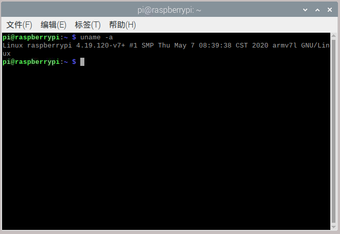
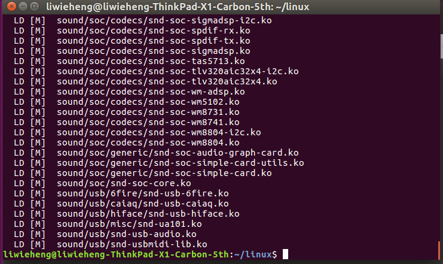
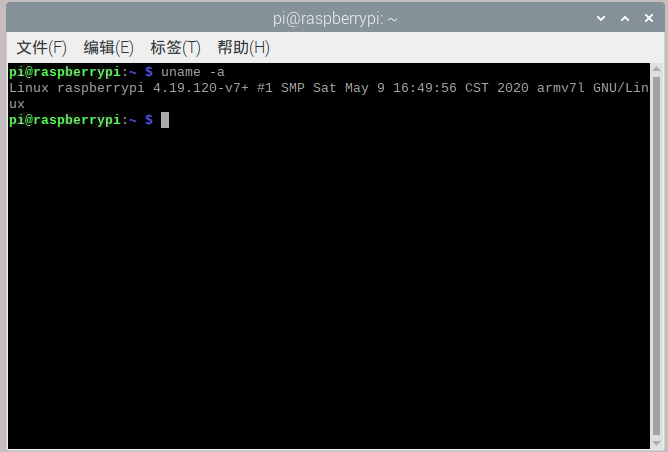
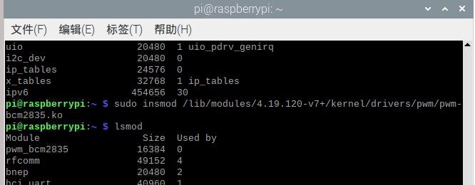
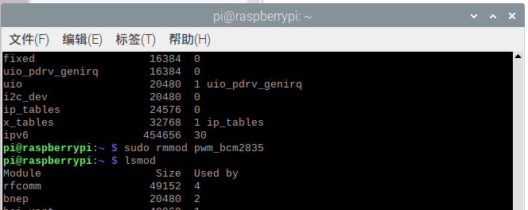
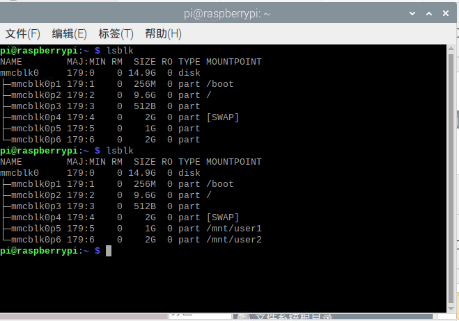

# **<center><font size=6>嵌入式软件开发技术与工具实验报告五</font></center>**

<center><font>黎炜桁</font></center>

---

### **一、实验目的**   

- 掌握裁剪Linux内核的方法，理解内核选项的意义；     
- 熟悉编译内核并加载内核到目标系统的方法与过程；   
- 了解模块与内核的关系，掌握内核模块配置编译、安装与卸载流程，为进一步编程，如驱动编程打下基础；     
- 掌握创建、安装(卸载)并使用文件系统的方法。    

### **二、实验内容**   

1. 首先用默认配置重新编译一遍已安装到开发板的内核，将新的内核替换现有内核，检查是否通过！   
2. 在原始版本基础上，重新配置Linux内核，构建一个嵌入式的Linux内核；    
3. 编译安装重新配置后的内核、模块及dtbs设备树；     
4. 针对默认配置中不少于10个kernel feature进行重新配置（裁剪为主、偶有增加），并解释理由；(Y=>N，N=>Y)   
5. 保留必要的模块安装，剩余(占多数)取消；(M=>N)   
6. make后将新的内核安装到开发板运行测试；    
7. 选择至少二个模块加载与卸载，检查是否加载、卸载成功；
8. 构建并安装至少一款不同于根文件系统、用于应用开发的其它文件系统。    

### **三、实验过程与结果**   

#### 1. 使用默认配置编译内核替换现有内核   
- 从github下载官方Linux源码到本地   

      

- 在目录下使用默认设置配置.config文件   

   ```shell
   cd linux
   KERNEL=kernel7
   make ARCH=arm CROSS_COMPILE=arm-linux-gnueabihf- bcm2709_defconfig
   ```

- `make ARCH=arm CROSS_COMPILE=arm-linux-gnueabihf- zImage modules dtbs`编译文件，生成内核zImage、模块modules和设备树dtbs

      

- `sudo env PATH=$PATH make ARCH=arm CROSS_COMPILE=arm-linux-gnueabihf- INSTALL_MOD_PATH=/mnt/ext4 modules_install`在ext4分区安装module


- 挂载SD卡，安装内核及dtb文件   

   ```shell
  sudo cp mnt/fat32/$KERNEL.img mnt/fat32/$KERNEL-backup.img
  sudo cp arch/arm/boot/zImage mnt/fat32/$KERNEL.img
  sudo cp arch/arm/boot/dts/*.dtb mnt/fat32/
  sudo cp arch/arm/boot/dts/overlays/*.dtb* mnt/fat32/overlays/
  sudo cp arch/arm/boot/dts/overlays/README mnt/fat32/overlays/
  sudo umount mnt/fat32
  sudo umount mnt/ext4
  ```

   


- 插入SD卡，开启树莓派，在终端运行`uname -a`查询内核版本，观察到内核已更新为4.19.120，内核生成时间为2020年5月7日，内核更换成功

   

- 总结
内核更换的过程中需要注意树莓派官方的building kernel文档所给出的命令存在路径的错误，需要在SD卡路径前补上斜杠`mnt/fat32 -> /mnt/fat32`，否则无法安装module及内核，另外挂载SD卡时注意使用sudo，否则会有读写权限问题。

#### 2. 重新配置Linux内核，裁剪驱动和模块   

##### 1. 内核裁剪

- 参考：<https://blog.csdn.net/lh2016rocky/article/details/70882449>
<https://blog.csdn.net/qq_21078557/article/details/83044057>
- 对编译进内核内容的裁剪，主要裁剪device driver部分

| 位置 | 内容 | 备注 | 操作 |
| :-: | :-: | :-: | :-: |
-|SCSI device support | SCSI device support | SCSI设备支持|Y-> N
-|Multiple devices driver support (RAID and LVM) |磁盘阵列支持 | Y -> N |
|Network deivce support|ATM drivers| ATM协议 用于路由交换|Y -> N
|Network device support|ISDN support| 综合业务数字网| Y->N
|USB Network Adapters|Simple USB Network Links|简易USB网络连接| 
-|FDDI driver support |光纤分布式数据接口 |Y -> N
-|Open-Channel SSD target support 开放通道SSD | Y -> N
input device support|Joysticks/Gamepads |游戏操纵杆驱动| Y-> N
input device support|Touchscreens| 触控板驱动 |Y -> N
|Character devices | Legacy (BSD) PTY support| 传统伪终端 | Y->N
|Character devices|TPM Hardware Support|基于硬件的“可信赖平台模块” | Y -> N
|Remote Controller support |Remote controller decoders | 模拟TV |Y -> N
|Multimedia devices|Analog TVsupport | 模拟TV |Y -> N
|Multimedia devices|Digital TVsupport | 数字TV |Y -> N
|AM/FM radio receivers|transmitters support|广播传输 |Y -> N
-|Virtio drivers| 虚拟化驱动 | Y -> N

模块部分裁剪太多，在此略过。

- 配置menuconfig后，输入`make ARCH=arm CROSS_COMPILE=arm-linux-gnueabihf- zImage modules dtbs -j4`对内核进行编译，-j4可对编译过程进行多核优化，加快编译时间。

  

- 编译完成后得到新的kernel7.img，比较默认设置编译出的内核大小，裁剪后的内核比裁剪前减小了119392字节。二者大小差距不大的原因是第一次接触内核裁剪，对内核的裁剪较为保守，在充分理解各个选项的含义后可以做到更加优化的裁剪。

   

- 将裁剪后的内核、模块、dtb设备树写入树莓派SD卡中，启动树莓派，在终端运行`uname -a`查询内核生成时间，为2020年5月9日，裁剪后的内核运行成功。

   

##### 2. 模块的加载与卸载   

- 运行`lsmod`命令查看当前运行的模块

   

- 在`/lib/modules/4.19.120-v7+/kernel/drivers/`目录下可查看安装到树莓派中的模块，选择`/connector/cn.ko`尝试进行模块的加载，使用`sudo insmod /lib/modules/4.19.120-v7+/kernel/drivers/connector/cn.ko`加载模块，`lsmod`查看运行的模块，cn模块加载成功。

  

  运行`sudo rmmod cn`卸载模块，`lsmod`查看运行的模块，cn模块消失，卸载成功。

  

- 选择`/pwm/pwn-bcm2835.ko`尝试加载第二个模块，`lsmod`查看运行的模块，pwn_bcm2835模块加载成功。

  

  运行`sudo rmmod pwn_bcm2835`卸载模块，`lsmod`查看运行的模块，pwn_bcm2835模块消失，卸载成功。

    

- 总结
内核的裁剪通过`make menuconfig`进行，大部分以模块形式加载的驱动可以裁剪掉以减小空间，而编译入内核的功能则需要仔细考虑，需要充分理解每个选项所代表的意义，才能做出正确的裁剪，在嵌入式系统的条件下，可以根据项目需求对内核进行裁剪，以获得最佳的性能。

 #### 3. 构建文件系统    
 
- 树莓派官方文件系统由fat格式boot分区和ext4格式rootfs分区组成。目前SD卡仅使用了8GB的容量，还有约7GB的空闲空间。

   
   

- 尝试在树莓派端采用gparted工具对分区进行调整，由于根目录正在使用中，无法对分区进行修改，故将SD卡挂载到PC上对分区进行调整，压缩出5GB空间构建文件系统。

   

- 在此基础上，将空余的5GB空间分为:1GB ext3系统挂载到/mnt/user1作为第一个存储分区，2GB ext3系统挂载到/mnt/user2作为第二个存储分区，通过建立3GB扩展分区实现，另外建立2GB swap作为交换空间提升树莓派性能，因为树莓派3B+内存为1GB，故交换空间设置为内存的两倍。

   

  使用`sudo mount /dev/mmcblk0p5 /mnt/user1`命令将分出的ext3分区挂载到/mnt目录下，修改`/etc/fstab`文件，加入`/dev/mmcblk0p5  /mnt/user1  ext3 defaults 0 0    |        /dev/mmcblk0p6  /mnt/user2  ext3 defaults 0 0`实现开机挂载。

    

  挂载成功后的文件系统如图所示。

    

- 设置tmpfs优化文件系统性能
tmpfs是将文件写入到内存中虚拟文件系统，掉电后消失，适用于将频繁读写的文件，设置为tmpfs以减少对SD卡的读写，另外，内存的读写速率比SD卡快，该操作也可以提升性能。

在`/etc/fstab`文件中加入  
``` shell
tmpfs /tmp tmpfs defaults,noatime,nosuid,size=100m 0 0
tmpfs /var/log tmpfs defaults,noatime,nosuid,mode=0755,size=100m 0 0
tmpfs /var/spool/mqueue tmpfs defaults,noatime,nosuid,mode=0700,gid=12,size=30m 0 0
``` 
将/tmp，/var/log，/var/spoll/mqueue文件夹挂载为tmpfs。

   

- 总结
树莓派的文件系统仅支持ext2、ext3、ext4、fat16、fat32格式，因此选择了ext3格式构建文件系统，并将常用文件夹挂载为tmpfs，减少对SD卡的读写，另外设置了2GB交换空间提升系统性能。

### **四、实验总结**   

本次实验我掌握了裁剪Linux内核的方法，理解了内核选项的意义，并根据项目要求对内核进行了裁剪，构建项目所需的文件系统。    
