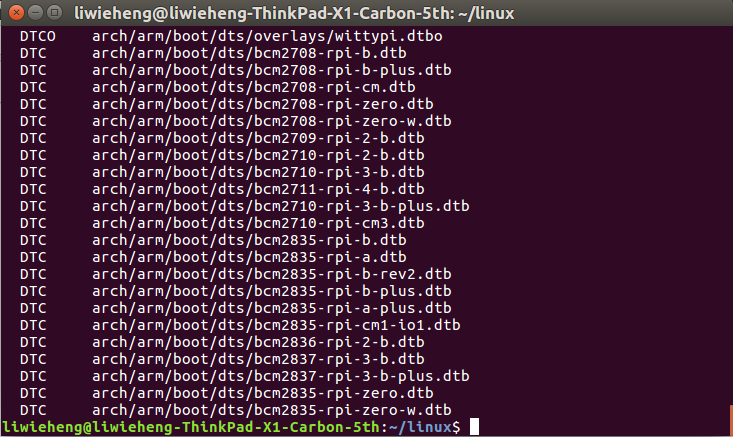
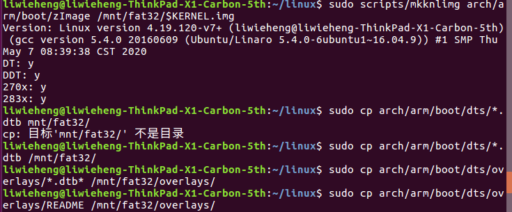

# **<center><font size=6>嵌入式软件开发技术与工具实验报告五</font></center>**

<center><font>黎炜桁</font></center>

---

### **一、实验目的**   

- 掌握裁剪Linux内核的方法，理解内核选项的意义；     
- 熟悉编译内核并加载内核到目标系统的方法与过程；   
- 了解模块与内核的关系，掌握内核模块配置编译、安装与卸载流程，为进一步编程，如驱动编程打下基础；     
- 掌握创建、安装(卸载)并使用文件系统的方法。    

### **二、实验内容**   

1. 首先用默认配置重新编译一遍已安装到开发板的内核，将新的内核替换现有内核，检查是否通过！   
2. 在原始版本基础上，重新配置Linux内核，构建一个嵌入式的Linux内核；    
3. 编译安装重新配置后的内核、模块及dtbs设备树；     
4. 针对默认配置中不少于10个kernel feature进行重新配置（裁剪为主、偶有增加），并解释理由；(Y=>N，N=>Y)   
5. 保留必要的模块安装，剩余(占多数)取消；(M=>N)   
6. make后将新的内核安装到开发板运行测试；    
7. 选择至少二个模块加载与卸载，检查是否加载、卸载成功；
8. 构建并安装至少一款不同于根文件系统、用于应用开发的其它文件系统。    

### **三、实验过程与结果**   

#### 1. 使用默认配置编译内核替换现有内核   
- 从github下载官方Linux源码到本地   

      

- 在目录下使用默认设置配置.config文件   

   ```shell
   cd linux
   KERNEL=kernel7
   make ARCH=arm CROSS_COMPILE=arm-linux-gnueabihf- bcm2709_defconfig
   ```

- `make ARCH=arm CROSS_COMPILE=arm-linux-gnueabihf- zImage modules dtbs`编译文件，生成内核zImage、模块modules和设备树dtbs

      

- `sudo env PATH=$PATH make ARCH=arm CROSS_COMPILE=arm-linux-gnueabihf- INSTALL_MOD_PATH=/mnt/ext4 modules_install`在ext4分区安装module


- 挂载SD卡，安装内核及dtb文件   

   ```shell
  sudo cp mnt/fat32/$KERNEL.img mnt/fat32/$KERNEL-backup.img
  sudo cp arch/arm/boot/zImage mnt/fat32/$KERNEL.img
  sudo cp arch/arm/boot/dts/*.dtb mnt/fat32/
  sudo cp arch/arm/boot/dts/overlays/*.dtb* mnt/fat32/overlays/
  sudo cp arch/arm/boot/dts/overlays/README mnt/fat32/overlays/
  sudo umount mnt/fat32
  sudo umount mnt/ext4
  ```

   


- 插入SD卡，开启树莓派，在终端运行`uname -a`查询内核版本，观察到内核已更新为4.19.120，时间为2020年5月7日，内核更换成功

   

- 总结
内核更换的过程中需要注意树莓派官方的building kernel文档所给出的命令存在路径的错误，需要在SD卡路径前补上斜杠`mnt/fat32 -> /mnt/fat32`，否则无法安装module及内核，另外挂载SD卡时注意使用sudo，否则会有读写权限问题。

#### 2. 重新配置Linux内核，裁剪驱动和模块   

- 参考网页：Linux内核裁剪<https://blog.csdn.net/lh2016rocky/article/details/70882449>

<https://blog.csdn.net/qq_21078557/article/details/83044057>
#### 3. 构建文件系统    


### **四、实验总结**   

本次实验我掌握了裁剪Linux内核的方法，理解了内核选项的意义，并根据项目要求对内核进行了裁剪，构建项目所需的文件系统。    
